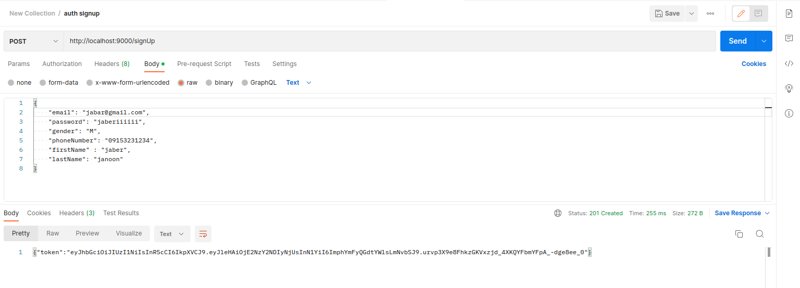
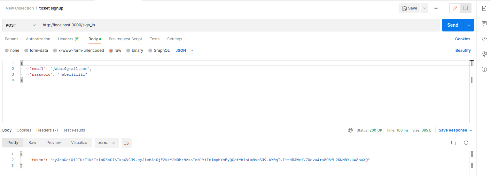

## changes

change this line in db.go:

```go
		Addr:     "localhost:6379",
```

to 

```go
		Addr:     "host.docker.internal:8020",
```

## Dockerfile

this file is placed at the root directory
also, you could either change the golang version from here or the go.mod file to match each other.

<div>

```Dockerfile
FROM golang:1.17-alpine
WORKDIR /usr/src/goapp
COPY go.mod ./
COPY go.sum ./
COPY *.go ./
Copy models/*.go ./models/
COPY utils/*.go ./utils/
COPY certs/* ./certs/
RUN go mod tidy -compat=1.17
RUN go build -o /docker-go-sha
EXPOSE 9000
CMD [ "/docker-go-sha" ]
```

</div>

## command

```bash
sudo docker build . -t shahab/auth
sudo docker run -p 9000:9000 --add-host=host.docker.internal:host-gateway shahab/auth
```

## output

```bash
Sending build context to Docker daemon  31.74kB
Step 1/13 : FROM golang:1.17-alpine
 ---> 270c4f58750f
Step 2/13 : WORKDIR /usr/src/goapp
 ---> Using cache
 ---> 0c6270b424d8
Step 3/13 : COPY go.mod ./
 ---> Using cache
 ---> 3510e8b3b37b
Step 4/13 : COPY go.sum ./
 ---> Using cache
 ---> 3bf70f297832
Step 5/13 : COPY *.go ./
 ---> d366a7c9c47d
Step 6/13 : COPY .env ./
 ---> ad0f5d0c7a38
Step 7/13 : Copy models/*.go ./models/
 ---> c35e26b3fe54
Step 8/13 : COPY utils/*.go ./utils/
 ---> bb543e3298be
Step 9/13 : COPY certs/* ./certs/
 ---> b7eb2c38ae52
Step 10/13 : RUN go mod tidy -compat=1.17
 ---> Running in 44a70f884fe1
go: downloading github.com/lib/pq v1.10.6
go: downloading golang.org/x/crypto v0.0.0-20220411220226-7b82a4e95df4
go: downloading github.com/go-redis/redis/v8 v8.11.5
go: downloading github.com/golang-jwt/jwt/v4 v4.4.3
go: downloading github.com/joho/godotenv v1.4.0
go: downloading github.com/onsi/gomega v1.25.0
go: downloading github.com/dgryski/go-rendezvous v0.0.0-20200823014737-9f7001d12a5f
go: downloading github.com/cespare/xxhash/v2 v2.1.2
go: downloading github.com/onsi/ginkgo v1.16.5
go: downloading github.com/google/go-cmp v0.5.9
go: downloading gopkg.in/yaml.v3 v3.0.1
go: downloading golang.org/x/net v0.5.0
go: downloading golang.org/x/sys v0.4.0
go: downloading github.com/nxadm/tail v1.4.8
go: downloading golang.org/x/text v0.6.0
go: downloading gopkg.in/tomb.v1 v1.0.0-20141024135613-dd632973f1e7
go: downloading github.com/fsnotify/fsnotify v1.5.1
Removing intermediate container 44a70f884fe1
 ---> 3cc3b593ecc4
Step 11/13 : RUN go build -o /docker-go-sha
 ---> Running in 0deb2f8cfd6a
Removing intermediate container 0deb2f8cfd6a
 ---> 915291588f29
Step 12/13 : EXPOSE 9000
 ---> Running in 006830030ff4
Removing intermediate container 006830030ff4
 ---> 8a58dbdced6b
Step 13/13 : CMD [ "/docker-go-sha" ]
 ---> Running in e50c2e202f0e
Removing intermediate container e50c2e202f0e
 ---> 6bc7b5cb594d
Successfully built 6bc7b5cb594d
Successfully tagged shahab/auth:latest
auth service is running...
```

## and testing:




as you can see, it works and ticket service can also send it requests.
