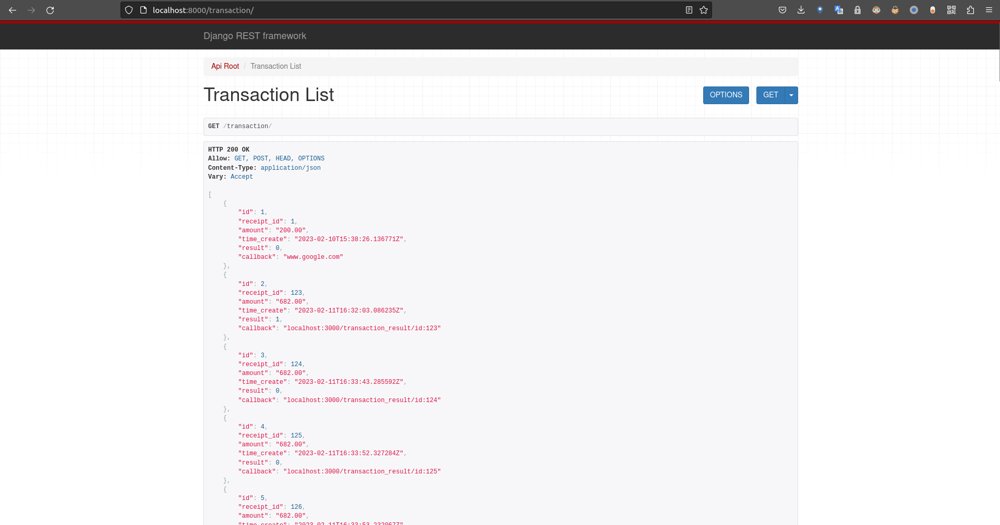
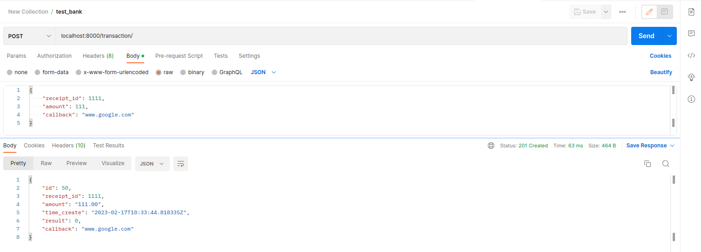

## Dockerfile

this file is placed at the root directory

<div>

```Dockerfile
FROM python:3.10-alpine

ENV PYTHONDONTWRITEBYTECODE 1
ENV PYTHONUNBUFFERED 1

WORKDIR /usr/src/bank
COPY bank/* ./bank/
COPY templates/* ./templates/
COPY wp_bank/* ./wp_bank/
COPY manage.py ./
COPY db.sqlite3 ./

EXPOSE 8000
RUN pip3 install django djangorestframework  # Use pip3 in linux and macOS

RUN python3 manage.py migrate
CMD ["python3", "manage.py", "runserver", "0.0.0.0:8000"]
```

</div>

## command
```bash
sudo docker build . -t shahab/bank
sudo docker run -p 8000:8000 shahab/bank
```

## output

```
Sending build context to Docker daemon  208.4kB
Step 1/13 : FROM python:3.10-alpine
 ---> 19a69a6363f0
Step 2/13 : ENV PYTHONDONTWRITEBYTECODE 1
 ---> Using cache
 ---> 574fa72277f7
Step 3/13 : ENV PYTHONUNBUFFERED 1
 ---> Using cache
 ---> 86bddff8c86e
Step 4/13 : WORKDIR /usr/src/bank
 ---> Using cache
 ---> 68c118b9d246
Step 5/13 : COPY bank/* ./bank/
 ---> Using cache
 ---> 6fecae47c4b0
Step 6/13 : COPY templates/* ./templates/
 ---> Using cache
 ---> 6362c6641732
Step 7/13 : COPY wp_bank/* ./wp_bank/
 ---> Using cache
 ---> 8580de083e85
Step 8/13 : COPY manage.py ./
 ---> Using cache
 ---> 6a5d7ff035a1
Step 9/13 : COPY db.sqlite3 ./
 ---> Using cache
 ---> d7846017dd79
Step 10/13 : EXPOSE 8000
 ---> Using cache
 ---> d7a7597d7c01
Step 11/13 : RUN pip3 install django djangorestframework  # Use pip3 in linux and macOS
 ---> Using cache
 ---> 4cc2884f249c
Step 12/13 : RUN python3 manage.py migrate
 ---> Using cache
 ---> 557b5dfefe61
Step 13/13 : CMD ["python3", "manage.py", "runserver", "0.0.0.0:8000"]
 ---> Using cache
 ---> 253b7f1a188e
Successfully built 253b7f1a188e
Successfully tagged shahab/bank:latest
Watching for file changes with StatReloader
Performing system checks...

System check identified no issues (0 silenced).
February 17, 2023 - 10:30:23
Django version 4.1.7, using settings 'wp_bank.settings'
Starting development server at http://0.0.0.0:8000/
Quit the server with CONTROL-C.
```

## testing


