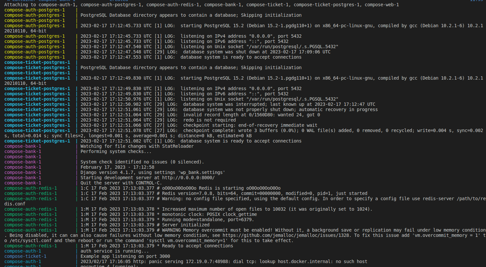
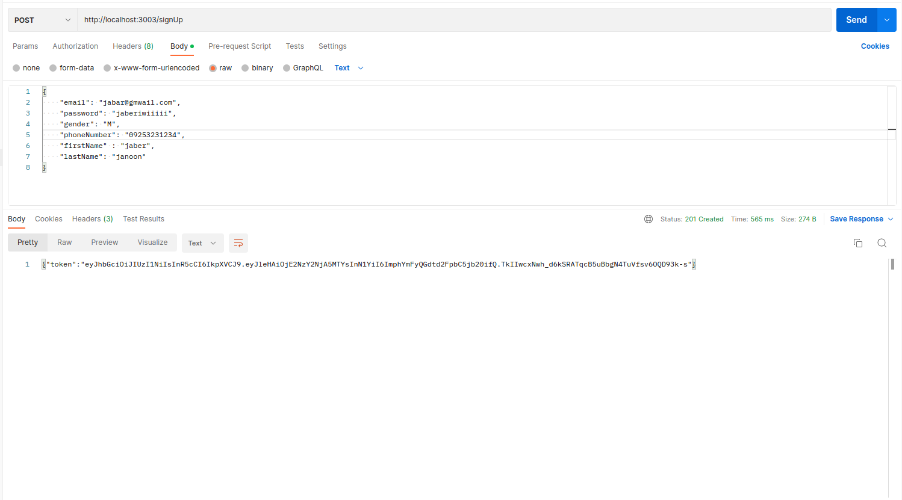
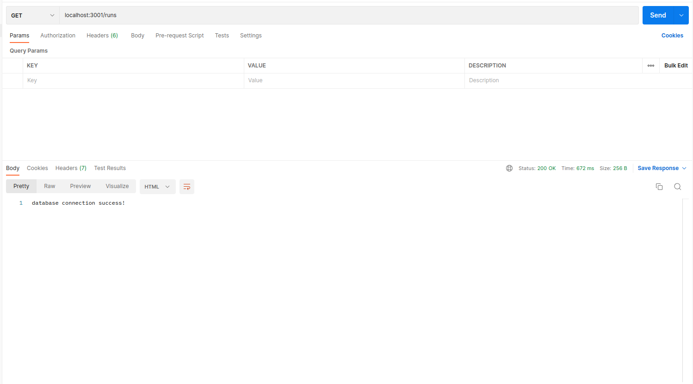
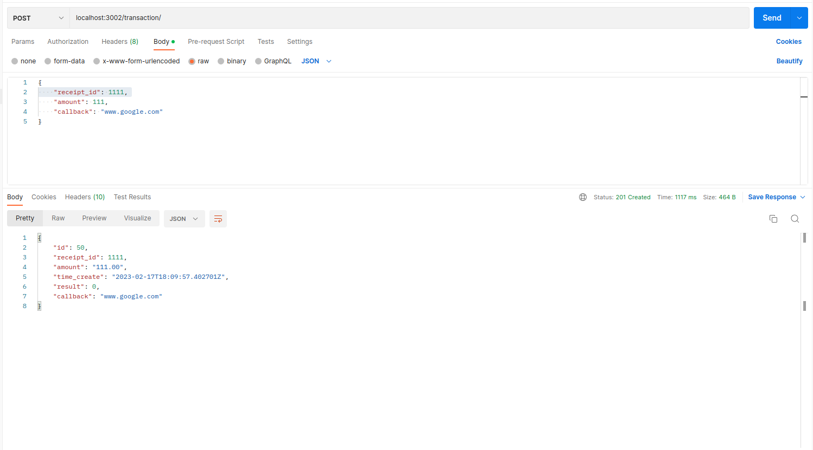

## changes

in the docker compose network space, our apps can find eachother with the
specified srevice name in docker-compose.yml. therefore we can replace 
addresses such as `host.docker.internal:8040` with `ticket-postgres:5432`.

## docker-compose.yml

first, we copy all of our projects into a folder, then we place this file in that folder:

```yaml
version: "3.9"

services:


  ticket-postgres:
    image: postgres:latest
    ports:
    - "8080:5432"
    environment:
      POSTGRES_PASSWORD: secretpassword
    volumes:
    - $HOME/docker/volumes/postgres:/var/lib/postgresql/data
 
  ticket:
    build: ./web
    ports:
      - "3001:3000"

  bank:
    build: ./Bank-master
    ports:
      - "3002:8000"

  auth:
    build: ./authService
    ports:
      - "3003:9000"
    extra_hosts:
      - "host.docker.internal:host-gateway"

  
  auth-redis:
    image: redis:latest
    ports:
    - "8020:6379"

  auth-postgres:
    image: postgres:latest
    ports:
    - "8040:5432"
    environment:
      POSTGRES_PASSWORD: secretpassword
    volumes:
    - $HOME/docker/volumes/postgres:/var/lib/postgresql/data

```

## commands

then we build and run with these commands:

``` bash
sudo docker compose build
sudo docker compose up
```

## output:

this part has a big output of logs, so here are some screenshots:

build:

up:



## test:

here are some api call examples in the docker compose:
(we have changed the ports so you can see the difference)






